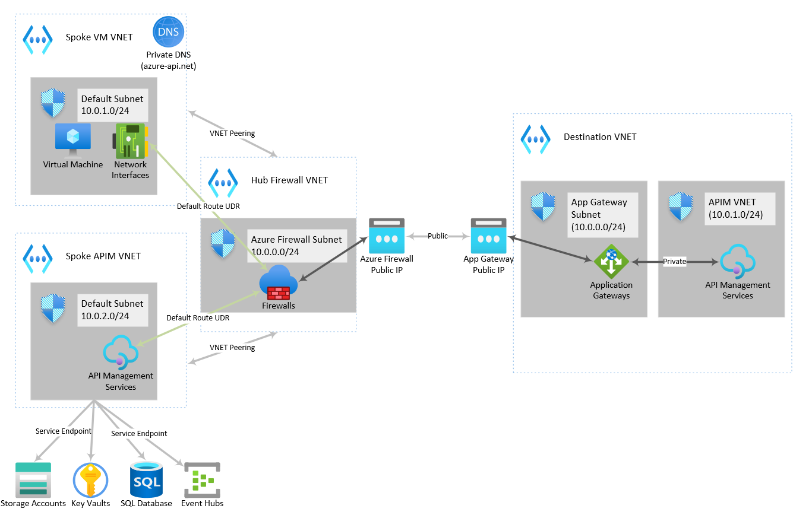

# Template: Create a Hub and Spoke Topolology with Two Internal APIMs and Azure Firewall

This template sets up a hub and spoke network with the following resources:

1. A spoke virtual network to host a client VM.
2. A spoke virtual network to host an internal virtual network-joined API Management service.
3. A hub virtual network to host Azure Firewall.
4. Virtual Network peerings between spokes and hub virtual network.
5. The aforementioned VM (Linux - Ubuntu) with a public IP.
6. The aforementioned API Management service joined to the virtual network with Internal configuration.
7. Azure Firewall with a public IP joined to the hub virtual network.
8. A private Azure DNS zone for the 'azure-api.net' is created and associated to the hub and spoke virtual networks.
9. An A record is created in the 'azure-api.net' DNS zone to allow the client VM to resolve the API Management's DNS name via a private IP.
10. Appropriate NSGs to allow API Management to deploy successfully, allow the Linux VM to run apt-get successfully.
11. A route table with a default route pointing all spoke traffic to the Azure Firewall and sending traffic to APIM's control plane IPs and your local IP to the internet (to allow SSH connections to the VM).
12. An entirely different virtual network (non-peered).
13. The virtual network will host an Application Gateway with a public IP front-ending a second API Management service joined to the same virtual network as the App Gateway.
14. The aforementioned Application Gateway.
15. The aforementioned second API Management service behind the Application Gateway, joined to same virtual network as the Application Gateway (different subnet).
16. A Log Analyics workspace.
17. All API Management services, Azure Firewall and Application Gateway will have diagnostic settings pushing all logs and metrics to the aforementioned Log Analytics workspace.
18. Defines a mock api in both APIMs. In the first APIM, the api will forward to the App Gateway over its public IP, the second APIM behind App Gateway will create a mock response using API Management policies.
19. Installs net-tools and traceroute in the client virtual machine.

The mock API is only configured to accept a web request in the following manner:

    GET http://{resource-prefix}-client-apim.azure-api.net/mockapi/

The first APIM can also accept the request in HTTPS as well. The API Management behind Application Gateway only accepts HTTP as SSL is not in the context of this sample.

# Intent and Routing

The intent of this template is to show how routing and a hub and spoke network is usually setup in Azure based on my experience. Once deployed, if we connect to the client VM and send a web request to the first API Management's mock API, the following will take place:

1. The client VM sends the web request using curl as such:

        curl http://{resourceprefix}-client-apim.azure-api.net/mockapi

2. Since the client VM's associated to an private Azure Azure DNS zone for 'azure-api.net' and the DNS zone has an A record entry of '{resourceprefix}-client-apim', the DNS resolution will resolve the fully-qualified domain name '{resourceprefix}-client-apim.azure-api.net' to API Management's internal IP.
3. Due to the client virtual machine being joined to a virtual network subnet that has a route table with a default route sending all non-specific traffic to Azure Firewall's IP (0.0.0.0/0, next hop type virtual appliance) TCP/IP traffic will be directed to Azure Firewall.
4. The connectivity between the client virtual machine and the Azure Firewall's virtual machine via Virtual Network Peering combined with the default route from step 2 will allow traffic to successfully route to Azure Firewall in the hub virtual network.
5. Azure Firewall will allow the connection to APIM as it is in its network or application rules to allow said connection.
6. As the Azure Firewall hub virtual network is peered with API Management's spoke virtual network, the connection is routed successfully to API Management.
7. API Management will match the URL to the mock api's GET operation and proceed to forward the request to '{resourceprefix}appgw.{region}.cloudapp.azure.net'.
8. Azure DNS will resolve '{resourceprefix}appgw.{region}.cloudapp.azure.net' to the application gateway's public IP.
9. As the API Management's virtual network subnet has the same default route as the client virtual machine's virtual network subnet and has an established Virtual Network peering with Azure Firewall's virtual network, the connection to Application Gateway is routed to Azure Firewall first.
10. Azure Firewall will allow the connection via application rules.
11. Because the destination is a public IP this time, the connection will be source network address translated (SNAT) as the Azure Firewall's public IP to allow for a successful connection and routing to the Azure Application Gateway's public IP.
12. Application Gateway will receive the request and forward the request to the second API Management via its internal IP.
13. The second API Management service will return a mock response.
14. Response traffic will route back in the same manner it routed incoming: Second APIM to Application Gateway, DNAT to Azure Firewall's public IP, DNAT to first API Management and directed via VNET peering, return back from the first API Management to Azure Firewall due to default route and VNET peering, directed to the client VM.
15. Both API Management services, the Application Gateway and the Azure Firewall will add their respective entries in the Log Analytics workspace.

# Topology

The following shows the resulting deployment in a network topology.

# Parameters

The parameters for this template as as follows:

1. 'resourcePrefix': This string will prefix all resource names.
2. 'vmUsername': This will be the SSH username to log on to the client virtual machine.
3. 'vmPassword': This will be the SSH password to log on to the client virtual machine.
4. 'apimPublisherName': The name of the publisher for both APIM services.
5. 'apimPublisherEMail': The e-mail address of the publisher for both APIM services.
6. 'yourIP': This IP will be added to the route tables used in the client virtual machines and first API Management service's spoke virtual network subnets to allow for successul SSH connectivity to the client virtual machine while skipping the Azure Firewall.

# Output

The following data will be returned as output upon a successful deployment:

1. 'VirtualMachineDNS': Will display the fully-qualified domain name to connect to the client virtual machine.
2. 'VirtualMachineIP': Will display the public IP assigned to the client virtual machine'.
3. 'VirtualMachineUsername': Will display the username that will be used for the SSH connection.
4. 'ApplicationGatewayDNS': Will display the fully-qualified domain name to send request to Application Gateway.
5. 'AppliucationGatewayIP': Will display the public IP assigned to the Application Gateway'.
4. 'AzureFirewallDNS': Will display the fully-qualified domain name to send request to Azure Firewall.
5. 'AzureFirewallIP': Will display the public IP assigned to the Azure Firewall'.
6. 'ClientAPIManageentGatewayUrl': The URL to use to send requests to the first API Management service.
7. 'ClientAPIManagementPrivateIpAddress': The private IP address assigned to the first API Management service.
8. 'DestinationAPIManagementGatewayUrl': The URL to use to send requests to the second API Management service behind the Application Gateway.
9. 'DestinationAPIManagementPrivateIpAddress': The private IP address assigned to the second API Management service behind the Application Gateway.

__IMPORTANT NOTE:__ Please note this template is for EDUCATIONAL PURPOSES ONLY and is provided AS IS without any warranty. Please note Microsoft may not support issues caused by using this template nor may support the template itself. Please file an issue against this repo and I will be happy to take a look.

`Tags: milope, templates, apim, azure, firewall, application gateway, peering, vnet, log analytics`
