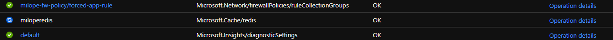
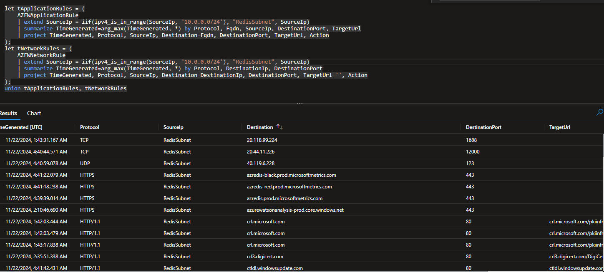

# Using Azure Firewall to Discover Cache for Redis Dependencies

The following is the final template after this research was completed.

[](https://portal.azure.com/#create/Microsoft.Template/uri/https%3a%2f%2fraw.githubusercontent.com%2fmilope%2fazuretools%2fmaster%2fsrc%2ftemplates%2fcache-for-redis%2fcache-for-redis-behind-az-firewall%2f03.final.json)
[](https://portal.azure.us/#create/Microsoft.Template/uri/https%3a%2f%2fraw.githubusercontent.com%2fmilope%2fazuretools%2fmaster%2fsrc%2ftemplates%2fcache-for-redis%2fcache-for-redis-behind-az-firewall%2f03.final.json)
[](http://armviz.io/#/?load=https%3a%2f%2fraw.githubusercontent.com%2fmilope%2fazuretools%2fmaster%2fsrc%2ftemplates%2fcache-for-redis%2fcache-for-redis-behind-az-firewall%2f03.final.json)

## Summary

One of the questions I get asked and ask myself often is _what IP or hostnames do we need to open for `insert Azure Service here`?. This article providers an approach to discovering these dependencies as long as the service can join an Azure virtual network.

The gist of this tactic is the following:

- Deploy a hub and spoke virtual network
- Host Azure Firewall in the hub network
- Setup the Azure Firewall diagnostic settings to push logs to Log Analytics
- Peer both virtual networks
- Setup a default route on the spoke virtual network to direct all non-specific traffic through Azure Firewall
- Attempt to deploy the service being investigated

Initially, deployment will fail as all dependencies are blocked, but as the dependencies are added and the dependencies are slowly added to the allowed lists, the deployment will succeed. There will be additional dependencies until the entries end.

> [!IMPORTANT NOTE] This article <span style="color:red">**does not**</span> act as a substitution to official Microsoft documentation as there may be use-cases that are missed.

## Template Parameters

| Name               | Type     | Required | Default                   | Description                                         |
|--------------------|----------|----------|---------------------------|-----------------------------------------------------|
| `Location`         | `string` | No       | Resource Group's location | Specified the location for all the resources        |
| `CacheName`        | `string` | Yes      | None                      | Cache for Redis resource name and Resource Prefix   |
| `FirewallDnsLabel` | `string` | Yes      | None                      | Specify the public DNS label for the Azure Firewall |
| `SpokeIPRange`     | `string` | No       | `10.0.0.0/24`             | Specify an address range for the spoke network      |
| `HubIPRange`       | `string` | No       | `10.0.1.0/24`             | Specify an address range for the hub network        |

## Resources Deployed

All templates will contain the following resources:

| Resource                 | Quantity | Purpose                                                                 |
|--------------------------|----------|-------------------------------------------------------------------------|
| Public IP Address        |        1 | Azure Firewall's public IP                                              |
| Log Analytics Workspace  |        1 | Stores the Firewall's diagnostic logs                                   |
| Network Security Group   |        1 | No security rules are added                                             |
| Virtual Networks         |        2 | Hub and spoke virtual networks                                          |
| Virtual Network Peerings |        2 | To interconnect the hub and spoke                                       |
| GitHub Rule Collection   |        1 | This is to force SNI output in the diagnostic logs                      |
| Empty Rule Collection    |        1 | This will be used to slowly add the discovered dependencies             |
| Azure Firewall           |        1 | Resource that will be performing the deny and logging dependencies      |
| Diagnostic Settings      |        1 | Diagnostic settings on the Firewall to log dependencies                 |
| Route Table              |        1 | Forces all non-specific outbound traffic through the Firewall           |
| Cache for Redis          |        1 | Cache for Redis on the blocked virtual network to discover dependencies |

## Initial Locked Down Template

Here is the initial fully locked down template before the correct rules are added to Azure Firewall `01.initial.bicep` or `01.initial.json`:

[](https://portal.azure.com/#create/Microsoft.Template/uri/https%3a%2f%2fraw.githubusercontent.com%2fmilope%2fazuretools%2fmaster%2fsrc%2ftemplates%2fcache-for-redis%2fcache-for-redis-behind-az-firewall%2f01.initial.json)
[](https://portal.azure.us/#create/Microsoft.Template/uri/https%3a%2f%2fraw.githubusercontent.com%2fmilope%2fazuretools%2fmaster%2fsrc%2ftemplates%2fcache-for-redis%2fcache-for-redis-behind-az-firewall%2f01.initial.json)
[](http://armviz.io/#/?load=https%3a%2f%2fraw.githubusercontent.com%2fmilope%2fazuretools%2fmaster%2fsrc%2ftemplates%2fcache-for-redis%2fcache-for-redis-behind-az-firewall%2f01.initial.json)

The expectation here is that the Cache for Redis will fail as it will not be able to start the service. In the meantime, Azure Firewall will be logging all its deny firewall logs in Log Analytics. Unfortunately, we will definitely not get an exhaustive list right away. We will have to continue to log deny entries and allow them until Cache for Redis successfully deploys. Here is the first attempt:



Log Analtytics Azure Firewall Rules query to search for dependencies and their latest action (`Allow` or `Deny`):

```kql
let tApplicationRules = (
    AZFWApplicationRule
    | extend SourceIp = iif(ipv4_is_in_range(SourceIp, '10.0.0.0/24'), "RedisSubnet", SourceIp)
    | summarize TimeGenerated=arg_max(TimeGenerated, *) by Protocol, Fqdn, SourceIp, DestinationPort, TargetUrl
    | project TimeGenerated, Protocol, SourceIp, Destination=Fqdn, DestinationPort, TargetUrl, Action
);
let tNetworkRules = (
    AZFWNetworkRule
    | extend SourceIp = iif(ipv4_is_in_range(SourceIp, '10.0.0.0/24'), "RedisSubnet", SourceIp)
    | summarize TimeGenerated=arg_max(TimeGenerated, *) by Protocol, DestinationIp, DestinationPort
    | project TimeGenerated, Protocol, SourceIp, Destination=DestinationIp, DestinationPort, TargetUrl='', Action
);
union tApplicationRules, tNetworkRules
```



Now that we are observing the list of deny entries, I will begin updating the template to add network or application rules to the Azure Firewall Policy until I allow all enough endpoints for the Cache for Redis service to finish deploying. Ultimately, the observation was that the following endpoints were needed before Azure Cache for Redis deployed successfully. Please note this list may not be exahustive and is subject to change as time goes by.

- Windows Dependencies:
  - go.microsoft.com
  - settings-win.data.microosft.com
  - *.update.microsoft.com
  - *.events.data.microsoft.com
  - ctldl.windowsupdate.com
  - crl.microsoft.com
  - www.msftconnecttest.com
  - definitionupdates.microsoft.com
  - *.delivery.mp.microsoft.com
  - validation-v2.sls.microsoft.com
- Antivirus Dependencies:
  - wdcp.microsoft.com
  - wdcpalt.microsoft.com
- Azure Monitor:
  - gcs.prod.monitoring.`{monitorEndpointSuffix}`
  - *.prod.warm.ingest.monitor
- Azure Storage:
  - *.blob.`{storageEndpointSuffix}`
  - *.queue.`{storageEndpointSuffix}`
- Azure Key Vault:
  - *.`{keyvaultEndpointSuffix}`

I highly recommend the rules with a wildcard stay as such as the Storage and Key Vault endpoints can have unique name per service. Below is the template that allowed Cache for Redis to deploy successfully (`02.deployment.bicep` or `02.deployment.json`):

[](https://portal.azure.com/#create/Microsoft.Template/uri/https%3a%2f%2fraw.githubusercontent.com%2fmilope%2fazuretools%2fmaster%2fsrc%2ftemplates%2fcache-for-redis%2fcache-for-redis-behind-az-firewall%2f02.deployment.json)
[](https://portal.azure.us/#create/Microsoft.Template/uri/https%3a%2f%2fraw.githubusercontent.com%2fmilope%2fazuretools%2fmaster%2fsrc%2ftemplates%2fcache-for-redis%2fcache-for-redis-behind-az-firewall%2f02.deployment.json)
[](http://armviz.io/#/?load=https%3a%2f%2fraw.githubusercontent.com%2fmilope%2fazuretools%2fmaster%2fsrc%2ftemplates%2fcache-for-redis%2fcache-for-redis-behind-az-firewall%2f02.deployment.json)

Following a successful deployment, we continue to monitor any other outbound connection from the Cache for Redis. The following dependencies were observed. Please note this list is not exhaustive. Also, checkpoints with a question mark '?' indicate that I was not entirely sure what it was for following some research on public documentation available.

| Protocol | Destination Host | Destination Port | Usage |
|----------|------------------|------------------|-------|
| HTTPS | *.blob.core.windows.net | 443 | Azure Storage Dependency |
| HTTPS | *.table.core.windows.net | 443 | Azure Storage Dependency |
| HTTPS | *.queue.core.windows.net | 443 | Azure Storage Dependency |
| HTTPS | *.file.core.windows.net | 443 | Azure Storage Dependency |
| HTTPS | *.vault.azure.net | 443 | Azure Key Vault Dependency |
| HTTPS | *.prod.warm.ingest.monitor.core.windows.net | 443 | Azure Monitor |
| HTTPS | azredis-black.prod.microsoftmetrics.com | 443 | Azure Monitor |
| HTTPS | azredis-red.prod.microsoftmetrics.com | 443 | Azure Monitor |
| HTTPS | gcs.prod.monitoring.core.windows.net | 443 | Azure Monitor |
| HTTPS | global.prod.microsoftmetrics.com | 443 | Azure Monitor |
| HTTPS | azredis.prod.microsoftmetrics.com | 443 | Azure Monitor |
| HTTPS | shavamanifestazurecdnprod1.azureedge.net | 443 | Azure Monitor |
| HTTPS | shavamanifestcdnprod1.azureedge.net | 443 | Azure Monitor |
| HTTPS | azurewatsonanalysis-prod.core.windows.net | 443 | Azure Monitor |
| TCP | `AzureMonitor`.`RegionName` | 12000 | Azure Monitor |
| HTTP/1.1 | ctldl.windowsupdate.com | 80 | Windows PKI |
| HTTP/1.1 | crl.microsoft.com | 80 | Azure PKI |
| HTTP/1.1 | crl.microsoft.com | 80 | Azure PKI |
| HTTP/1.1 | ocsp.digicert.com | 80 | Azure PKI |
| HTTP/1.1 | crl3.digicert.com | 80 | Azure PKI |
| HTTP/1.1 | ocsp.digicert.com | 80 | Azure PKI |
| HTTP/1.1 | oneocsp.microsoft.com | 80 | Azure PKI |
| HTTPS | www.microsoft.com | 443 | Azure PKI |
| HTTPS | *.events.data.microsoft.com | 443 | Windows Telemetry |
| HTTP/1.1 | www.msftconnecttest.com | 80 | Network Connectivity Test |
| HTTPS | settings-win.data.microsoft.com | 443 | Settings Update |
| HTTPS | *.update.microsoft.com | 443 | Windows Update |
| HTTPS | go.microsoft.com | 443 | Windows Activation |
| HTTPS | validation-v2.sls.microsoft.com | 443 | Windows Activation |
| HTTPS | *.delivery.mp.microsoft.com | 443 | Windows Update |
| HTTPS | definitionupdates.microsoft.com | 443 | Antivirus Dependency |
| HTTPS | wdcp.microsoft.com | 443 | Antivirus Dependency |
| HTTPS | wdcpalt.microsoft.com | 443 | Antivirus Dependency |
| HTTPS | *.servicebus.windows.net | 443 | Service Bus Dependency |
| UDP | `AzureCloud`.`RegionName` | 123 | Windows NTP |
| TCP | `AzureCloud`.`RegionName` | 1688 | Windows KMS |

In the end, the following ended up being my final template. However, based on documentation used to discover some of these endpoints, it is likely this template still does not cover all possible dependencies (`03.final.bicep` or `03.final.json`).

[](https://portal.azure.com/#create/Microsoft.Template/uri/https%3a%2f%2fraw.githubusercontent.com%2fmilope%2fazuretools%2fmaster%2fsrc%2ftemplates%2fcache-for-redis%2fcache-for-redis-behind-az-firewall%2f03.final.json)
[](https://portal.azure.us/#create/Microsoft.Template/uri/https%3a%2f%2fraw.githubusercontent.com%2fmilope%2fazuretools%2fmaster%2fsrc%2ftemplates%2fcache-for-redis%2fcache-for-redis-behind-az-firewall%2f03.final.json)
[](http://armviz.io/#/?load=https%3a%2f%2fraw.githubusercontent.com%2fmilope%2fazuretools%2fmaster%2fsrc%2ftemplates%2fcache-for-redis%2fcache-for-redis-behind-az-firewall%2f03.final.json)

## License/Disclaimer

---

Copyright © 2022-2024 Michael Lopez

Permission is hereby granted, free of charge, to any person obtaining a copy of
this software and associated documentation files (the “Software”), to deal in
the Software without restriction, including without limitation the rights to
use, copy, modify, merge, publish, distribute, sublicense, and/or sell copies
of the Software, and to permit persons to whom the Software is furnished to do
so, subject to the following conditions:

The above copyright notice and this permission notice shall be included in all
copies or substantial portions of the Software.

THE SOFTWARE IS PROVIDED “AS IS”, WITHOUT WARRANTY OF ANY KIND, EXPRESS OR
IMPLIED, INCLUDING BUT NOT LIMITED TO THE WARRANTIES OF MERCHANTABILITY,
FITNESS FOR A PARTICULAR PURPOSE AND NONINFRINGEMENT. IN NO EVENT SHALL THE
AUTHORS OR COPYRIGHT HOLDERS BE LIABLE FOR ANY CLAIM, DAMAGES OR OTHER
LIABILITY, WHETHER IN AN ACTION OF CONTRACT, TORT OR OTHERWISE, ARISING FROM,
OUT OF OR IN CONNECTION WITH THE SOFTWARE OR THE USE OR OTHER DEALINGS IN THE
SOFTWARE.

`Tags: milope, templates, redis, firewall, az firewall, azfirewall, azurefirewall, dependency, detection`
