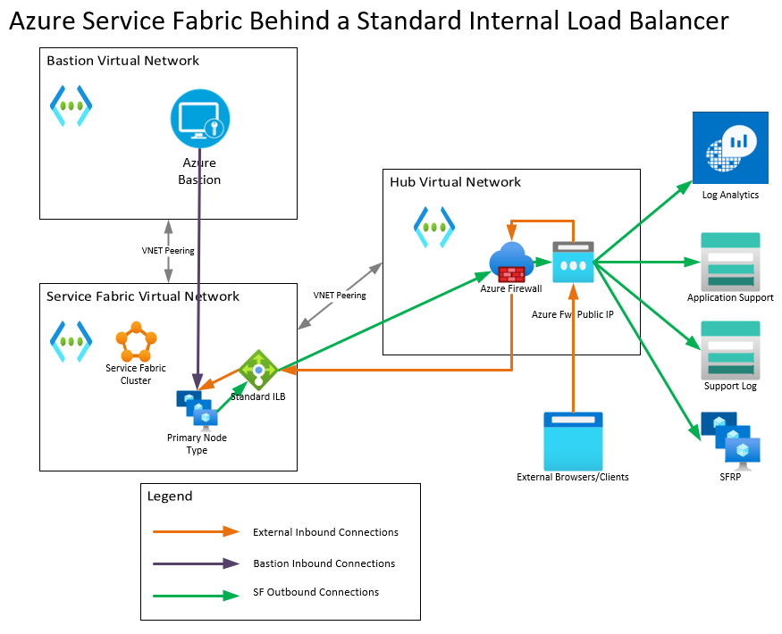

# Template: Create an Azure Service Fabric Cluster Behind a Standard Internal Load Balancer with no additional Standard External Load Balancer

## The License

Copyright © 2021 Michael Lopez

Permission is hereby granted, free of charge, to any person obtaining a copy of
this software and associated documentation files (the “Software”), to deal in
the Software without restriction, including without limitation the rights to
use, copy, modify, merge, publish, distribute, sublicense, and/or sell copies
of the Software, and to permit persons to whom the Software is furnished to do
so, subject to the following conditions:

The above copyright notice and this permission notice shall be included in all
copies or substantial portions of the Software.

THE SOFTWARE IS PROVIDED “AS IS”, WITHOUT WARRANTY OF ANY KIND, EXPRESS OR
IMPLIED, INCLUDING BUT NOT LIMITED TO THE WARRANTIES OF MERCHANTABILITY,
FITNESS FOR A PARTICULAR PURPOSE AND NONINFRINGEMENT. IN NO EVENT SHALL THE
AUTHORS OR COPYRIGHT HOLDERS BE LIABLE FOR ANY CLAIM, DAMAGES OR OTHER
LIABILITY, WHETHER IN AN ACTION OF CONTRACT, TORT OR OTHERWISE, ARISING FROM,
OUT OF OR IN CONNECTION WITH THE SOFTWARE OR THE USE OR OTHER DEALINGS IN THE
SOFTWARE.

## The Challenge
#
Normally, Service Fabric requires an outbound public IP in order to connect to its Service Fabric Resource Provider (SFRP). This presents a challenge when attempting to place Service Fabric behind a Standard **Internal** Load Balancer (ILB) as deployments associated to a Standard ILB are not given an ephemeral public IP as was observed with Basic ILBs. However, it is said that production workloads should use Standard load balancers, but internal-only deployments will need an External Standard Load Balancer. Our goal here is to just have the Standard Internal Load Balancer and no other load balancer associated to the cluster directly.

## The Proposed Solution
#
The idea then is to use a different device as a NAT IP. This template will be using Azure Firewall, but hypothetically, this could be achieved with Azure Virtual NAT or a full Azure WAN setup. This template will setup a 3-node Service Fabric cluster behind a Standard ILB. However, it will also deploy a hub and spoke topology with a forced tunnel to Azure Firewall. This should grant the Service Fabric cluster outbound connectivity to Service Fabric Resource Provider. The Firewall will have DNAT rules to translate traffic sent to its public IP, ports 19000 and 19080 to Service Fabric's ILB IP. An Azure Bastion is deployed on a separate hub Virtual Network to connect to the Cluster. External Service Fabric Explorer and Client Connections should now connect to the Azure Firewall public IP.

__IMPORTANT NOTE:__ Please note this template is for **EDUCATIONAL PURPOSES ONLY** and is provided AS IS without any warranty. Please note Microsoft may not support issues caused by using this template, may support the template itself nor the topology being setup as a proposed solution. If an issue is encountered, please file an issue against this repo and I will be happy to take a look.

## Template Parameter
#
This template specifies the following parameters:

- **Resource Prefix**: This parameter will be prefixed to most resource names. It is done for simplicity.
- **Your IP**: Specify your external IP to add the IP to the Azure Bastion NSG.
- **Username**: Admin username for the Virtual Machine Scale Set instances.
- **Username**: Admin password for the Virtual Machine Scale Set instances.
- **Source Vault**: Specify the source Key Vault that will have the cluster certificate. This template does **not** create the vault nor creates the cluster certificate.
- **Secret URI**: Specify the URL that will retrieve the cluster certificate from Key Vault.  This template does **not** create the vault nor creates the cluster certificate.
- **Certificate Thumbprint**: Specify the cluster certificate thumbprint.  This template does **not** create the vault nor creates the cluster certificate.

## Template Resources
#
This template deployes the following resources:

- **Two (2) Azure Storage Accounts**: These Azure Storage Accounts will be used as the application diagnostics and support logs for the Service Fabric cluster.
- **A Log Analytics workspace**: This will host the Azure Firewall diagnostic settings. The Azure Firewall will have all its metrics and logs pushed to this workspace via Azure Monitor diagnostic settings.
- **A blank Network Security Group**: This will be used for the Service Fabric cluster's VNET subnet.
- **An Azure Bastion Network Security Group**: This will be used for the Azure Bastion's VNET subnet.
- **A Route Tables**: One is used to force tunnel traffic from the Service Fabric spoke VNET to Azure Firewall.
- **A Spoke Virtual Networks**: The Spoke VNET will be used for the Service Fabric cluster.
- **Two (2) Hub Virtual Networks**: This hub will be peered with the Service Fabric spoke VNET and will host the Azure Firewall. The other Hub will host Azure Bastion
- **Four (4) VNET peerints**: Azure Bastion will be peered to the Service Fabric VNET. Service Fabric will be spoke to the Hub VNET.
- **A public IP**: This will be the Azure Firewall public IP.
- **An Azure Bastion Host**: This will be created to allow for public access to the Service Fabric VMSS.
- **An Azure Firewall Policy**: This policy will allow all outbound connections from the Service Fabric VNET and will create DNAT rules where connections to the Firewall public IP with destination ports 19000 and 19080 will be routed to the Service Fabric ILB's frontend private IP.
- **An Azure Firewall**: To utilize the aforemenioned Azure Firewall Policy and service as the otubound NAT for Service Fabric clusters.
- **A Standard Internal Load Balancer**: This ILB will serve as the front end private IP for the Service Fabric cluster. It creates a NAT pool for RDP and creates load balancing rules for port 19000 and 19080.
- **A Three (3)-Node Service Fabric Cluster**: This will be the Service Fabric cluster and VMSS that will host our Service Fabric cluster.

## Topology
#

The following is the topology showing how this template will be.

1. Bastion to Service Fabric can be achieved by peering the Bastion Hub VNET to the Service Fabric Spoke VNET.
2. Service Fabric outbound connections will force tunnel to the Azure Firewall, which will SNAT the connection, allowing outbound connectivity.
3. External inbound connections to Service Fabric should arrive from the Azure Firewall Public IP. Azure Firewall will use its DNAT rules to DNAT traffic to port 19000 and 19080 to the Internal Load Balancer IP.

## Resulting Template
#

__IMPORTANT NOTE:__ Please note this template is for **EDUCATIONAL PURPOSES ONLY** and is provided AS IS without any warranty. Please note Microsoft may not support issues caused by using this template, may support the template itself nor the topology being setup as a proposed solution. If an issue is encountered, please file an issue against this repo and I will be happy to take a look.

`Tags: milope, templates, service fabric, internal load balancer, ilb, standard, bastion`
