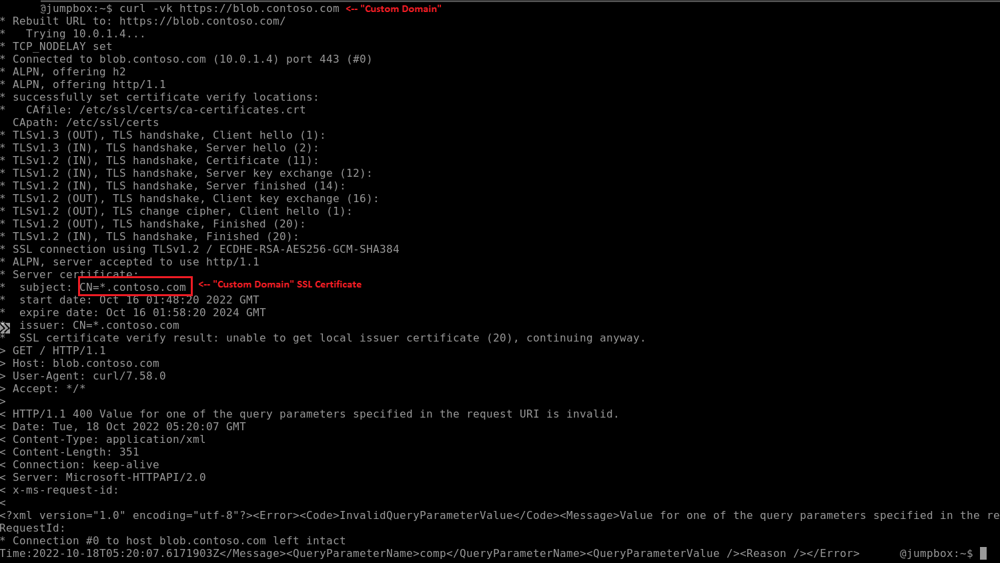

# Template: Azure Storage Accounts with "Custom domains" with full HTTPS support using Application Gateway with a Private IP

The purpose for this template is to show that Azure CDN is not the only option to achieve using Custom Domains with Azure Storage over HTTPS.

## Intent

Our general advice for a while has been to use Azure CDN to use custom domains with Azure Storage where HTTPS is involved. The reasoning stems behind the fact that at the time of writing, Azure Storage does not support importing custom SSL server certificates. The gist of using a CDN is to basically use a reverse proxy to perform the SSL validation while having it talk to storage. However, the situation is that this enables public access to Azure Storage. What if the intent is to achieve custom domains while using a private IP to access Azure Storage. This is where Application Gateway comes in. By using host header and SNI rewriting combined with the fact that Azure Application Gateway can enable a private IP via frontend IP configurations (this template's example) or private endpoints, we can achieve a private Azure Storage account with custom domains. This template shows an example on how to achieve the configuration via private IP Application Gateway frontend configuration, not via Application Gateway with private endpoints. Note that not only the Application Gateway will be accessed via a private IP, but also Application Gateway will reach out to Azure Storage via its own private endpoint. This template also sets up six Azure Storage endpoints: Blobs, Files, Queues, Tables, Azure Datalake Gen. 2, and Static Web Sites.

## Parameters

- **StorageAccountName**: Required. Specify a name for the Storage Account. Please note names must be unique within an environment as it is the public-facing DNS name. This name will also be used as resource prefix for the other resource names, except the private DNS zones.
- **Location**: The default location for all th resources. If unspecified, it will use the resource group's location.
- **AllowedIP**: Required. As this will be a deployment with Network Security Groups everywhere, specify an IP to be allowed to connect to the jumpbox virtual machine.
- **JumpboxUsername**: Required. Specify a username for the jumpbox Virtual machine.
- **JumpboxPassword**: Required. Specify a password securely for the jumpbox Virtual machine.
- **SSLSecretURL**: Required. Specify a Key Vault certificate secret URL to use for the Application Gateway's frontend SSL certificate. Since my custom domain is hardcoded to be contoso.com, the certificate should have a CN or SAN as *.contoso.com. As a future update, I will parameterize the custom domain.
- **KeyVaultManagedIdentityId**: Specify a user-assigned Managed Identity that will be assigned to the Application Gateway to access Azure Key Vault.
- **StorageAccessManagedIdentityId**: Specify a user-assigned Managed Identity that will be assigned to a deployment script that is used to enable Static Websites on the Storage Account. **NOTE**: At this time, I haven't found a way to enable Static Web Sites through resource management, hence I was forced to do it via deployment scripts. This is subject to change once a way is discovered to enable static web sites.

## Output

Currently, there are no outputs defined for this template.

## Resources Deployed

- **Trace Event Start** and **Trace Event End**: Used to track usage over Application Insights. I would ask that should you use my template to keep it.
- **Application Gateway**: The Application Gateway will serve as the 'custom domain' for the Azure Storage account. The intent here is to be able to access Application Gateway via custom domains (e.g.: `blob.contoso.com`, `dfs.contoso.com`, etc.). Application Gateway was each of the Storage Account endpoints as a fully qualified domain name in the backend settings. Using the probes' `pickHostNameFromBackendSettings` and the backend settings' `pickHostNameFromBackendAddress` attributes, we force both probe and runtime requests to use the correct Azure Storage account SNI and hostnames (e.g.: `*{StorageAccountName}*.blob.core.windows.net`, `*{StorageAccountName}*.dfs.core.windows.net`, so we don't have to setup custom domains in the Azure Storage account. For example: A request sent to `blob.contoso.com` will be rewritten as `*{StorageAccountName}*.blob.core.windows.net`. Since I did not want to deal with the complexity of probing failures, the probes are coded to expect response codes between 400 and 499. The Application Gateway also automatically redirects from HTTP to HTTPS. The Application Gateway will have both a public IP (required for Application Gateway V2) and private IP as frontend IP configurations. Only the private IP is used in request routing rules to Azure Storage. The storage Private Endpoints are used to force Application Gateway to resolve the Storage DNS to their private endpoint IPs.
- **Azure Bastion Host**: Used to access the jumpbox Virtual Machine.
- **Storage Account**: The Storage Account that will be used as a backend. The Storage Account will have public network access disabled, so it will only allow connections from its private endpoints.
- **Static Endpoint Deployment Script**: A script that uses a user-assigned Managed Identity to enable the Static Websites feature for the Azure Storage account.
- **Storage Account Private Endpoints**: Private Endpoints for blob, queue, table, dfs, web and file will be created for the Azure Storage Account.
- **(7x) Private DNS Zones**, **(7x) Private DNS Zone Virtual Network Links** and **(6x) Private DNS Zone Groups**: These serve as the private endpoints for the blob, queue, table, dfs, web and file services for the Azure Storage account. The Private DNS Zones are linked to the Virtual Network that is created in this template. The seventh Private DNS Zone and Private DNS Zone Virtual Network Link is used to allow the jumpbox to connect privately via 'custom domains' and send requests to Application Gateway.
- **Network Interface**: Used for the Jumpbox Virtual Machine.
- **(4x) Network Security Groups**: The Network Security Groups (NSG) are used to allow only traffic from the specified `AllowedIP` to the Azure Bastion Subnet and hence the jumpbox Virtual Machine. The NSG also only allow connections from the Bastion Subnet to the jumpbox Virtual Machine's subnet. The NSG restricts only Virtual Network to Virtual Network connection to the Application Gateway subnet and restricts the private endpoint subnets to only allow traffic from Application Gateway subnet, however I have not confirmed if the latter works at the time of writing.
- **(2x) Standard Public IPs**: One used by the Azure Bastion host and the other used by Application Gateway (required for V2 SKUs).
- **Virtual Network**: The virtual network is used to host the Azure Bastion host, the jumpbox Virtual Machine, the Application Gateway service and the Azure Storage private endpoints.
- **Virtual Machine**: Serves as a jumpbox Virtual Machine and is used to test the entire deployment.

## Remarks

Once the deployment succeeds, we can SSH into the jumpbox VM via Azure Bastion and use `curl -vk https://blob.contoso.com`, for example, to send requests using 'custom domains' to Azure Storage privately over HTTPS.

## License/Disclaimer

Copyright © 2022 Michael Lopez

Permission is hereby granted, free of charge, to any person obtaining a copy of
this software and associated documentation files (the “Software”), to deal in
the Software without restriction, including without limitation the rights to
use, copy, modify, merge, publish, distribute, sublicense, and/or sell copies
of the Software, and to permit persons to whom the Software is furnished to do
so, subject to the following conditions:

The above copyright notice and this permission notice shall be included in all
copies or substantial portions of the Software.

THE SOFTWARE IS PROVIDED “AS IS”, WITHOUT WARRANTY OF ANY KIND, EXPRESS OR
IMPLIED, INCLUDING BUT NOT LIMITED TO THE WARRANTIES OF MERCHANTABILITY,
FITNESS FOR A PARTICULAR PURPOSE AND NONINFRINGEMENT. IN NO EVENT SHALL THE
AUTHORS OR COPYRIGHT HOLDERS BE LIABLE FOR ANY CLAIM, DAMAGES OR OTHER
LIABILITY, WHETHER IN AN ACTION OF CONTRACT, TORT OR OTHERWISE, ARISING FROM,
OUT OF OR IN CONNECTION WITH THE SOFTWARE OR THE USE OR OTHER DEALINGS IN THE
SOFTWARE.

`Tags: milope, templates, storage, custom domain, custom, domains, private endpoints, private`
